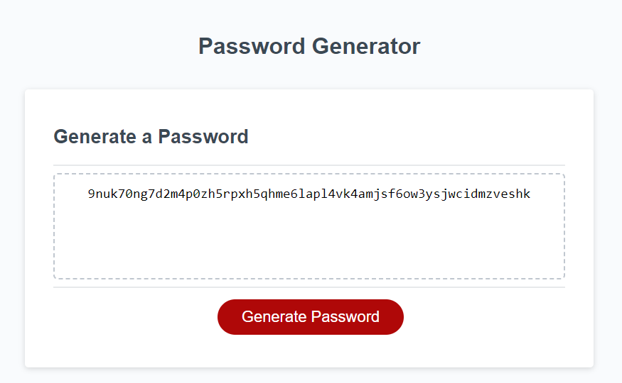

# Password-Factory
Generates passwords the way you want!

## Description 

This particular project is a website application that uses JavaScript to allow a user to generate a random password based on criteria they've selected via the browser's prompt.

URL: https://eiteltchap.github.io/Password-Factory/

## Installation

N/A

## Usage 

To start generating a password, click on the "Generate Password" botton on the page. This will prompt a pop-up message with the following instructions:

* Step 1 - Choose the length of your password. It must be between 8 and 128 characters.

* Step 2 - Select the character type(s) you would like to include in your generated password. Press the 'OK' botton to include the character type, otherwise press 'Cancel'. You must pick at least one character type. Character types include:
    * Lowercase
    * Uppercase
    * Numeric
    * Special characters ($@%&*, etc)

* Step 3 - The results would be shown in the webpage. You can now copy it and use it to maintain a strong security wherever you need it for.

## Credits

N/A

## License

Please refer to the LICENSE in the repo.

---
© 2023 edX Boot Camps LLC. Confidential and Proprietary. All Rights Reserved.